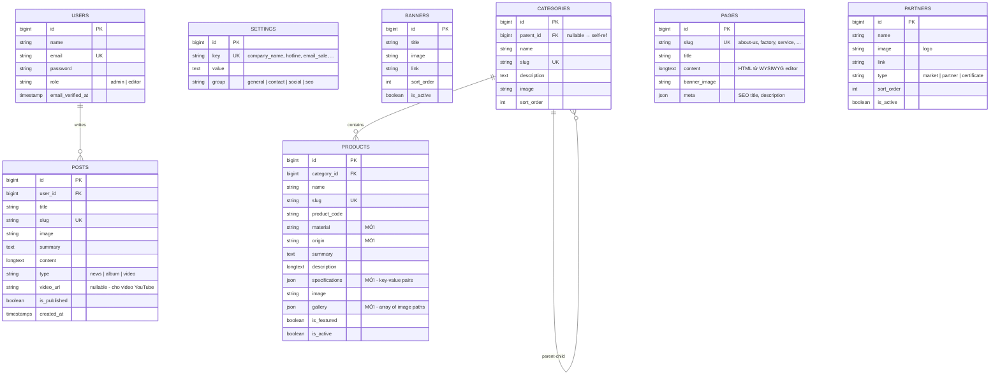

# Kế Hoạch Admin Dashboard — Bản Tối Ưu (v2)

> [!IMPORTANT]
> Bản plan v2 này đã được rà soát kỹ dựa trên **toàn bộ mã nguồn thực tế** — từng migration, model, controller, view, seeder — không còn phỏng đoán.

---

## 1. Audit Hiện Trạng: Cái Gì Đang Hardcode, Cái Gì Đã Dynamic?

### ✅ Đã có Database + Logic Dynamic (3 bảng)

| Bảng | Trạng thái | Ghi chú |
|------|-----------|---------|
| `categories` | ✅ Có migration, model, seeder (7 danh mục), quan hệ parent/children | **Nhưng navbar vẫn hardcode** cây menu 3 cấp trong `navbar.blade.php` |
| `products` | ✅ Có migration, model, seeder (8 sp mẫu), scope `featured/active` | **Nhưng trang chủ hardcode** toàn bộ 3 tab sản phẩm (60+ sản phẩm hardcode HTML) |
| `inquiries` | ✅ Có migration, model, controller + FormRequest validation | Hoạt động đúng — form gửi về lưu DB |

### ❌ 100% Hardcode cần chuyển sang Database

| Nội dung | File nguồn | Mô tả vấn đề |
|----------|-----------|---------------|
| **Banner slider** (5 ảnh) | [home.blade.php L36-88](file:///c:/Users/hochi/OneDrive/Máy tính/Project_Sota/resources/views/pages/home.blade.php#L36-L88) | 5 ảnh banner hardcode cả URL hình |
| **About Us section** (trang chủ) | [home.blade.php L100-203](file:///c:/Users/hochi/OneDrive/Máy tính/Project_Sota/resources/views/pages/home.blade.php#L100-L203) | Toàn bộ text giới thiệu + 8 bài viết OWL carousel |
| **3 Tab sản phẩm** (trang chủ) | [home.blade.php L206-700](file:///c:/Users/hochi/OneDrive/Máy tính/Project_Sota/resources/views/pages/home.blade.php#L206-L700) | ~60 sản phẩm hardcode HTML dù DB đã có bảng products |
| **Album ảnh** (5 ảnh) | [home.blade.php L704-760](file:///c:/Users/hochi/OneDrive/Máy tính/Project_Sota/resources/views/pages/home.blade.php#L704-L760) | 5 ảnh album hardcode |
| **Tin tức** (3 bài) | [home.blade.php L762-796](file:///c:/Users/hochi/OneDrive/Máy tính/Project_Sota/resources/views/pages/home.blade.php#L762-L796) | 3 tin tức hardcode |
| **Video YouTube** (4 video) | [home.blade.php L798-836](file:///c:/Users/hochi/OneDrive/Máy tính/Project_Sota/resources/views/pages/home.blade.php#L798-L836) | 4 video hardcode link YouTube |
| **Active Market** (8 logo) | [home.blade.php L837-898](file:///c:/Users/hochi/OneDrive/Máy tính/Project_Sota/resources/views/pages/home.blade.php#L837-L898) | 8 logo thị trường xuất khẩu hardcode |
| **Header**: Logo, Hotline, Địa chỉ | [header.blade.php](file:///c:/Users/hochi/OneDrive/Máy tính/Project_Sota/resources/views/components/header.blade.php) | Logo path, địa chỉ hardcode |
| **Footer**: 4 cột thông tin | [footer.blade.php](file:///c:/Users/hochi/OneDrive/Máy tính/Project_Sota/resources/views/components/footer.blade.php) | Email, hotline, mã số thuế, 2 địa chỉ nhà máy, link social, copyright — tất cả hardcode |
| **Navbar**: Menu 3 cấp + mô tả | [navbar.blade.php](file:///c:/Users/hochi/OneDrive/Máy tính/Project_Sota/resources/views/components/navbar.blade.php) | 197 dòng HTML cây menu hardcode cứng, không query từ DB |
| **Social Widgets** (Zalo, Hotline) | [social_widgets.blade.php](file:///c:/Users/hochi/OneDrive/Máy tính/Project_Sota/resources/views/components/social_widgets.blade.php) | 7,885 dòng CSS + HTML hardcode số hotline, link Zalo, Messenger |
| **44 trang tĩnh** | [pages/static/*.blade.php](file:///c:/Users/hochi/OneDrive/Máy tính/Project_Sota/resources/views/pages/static/) | Mỗi trang ~20-60KB HTML thuần, không lấy từ DB |
| **Thông số năng lực SX** | [HomeController.php L30-35](file:///c:/Users/hochi/OneDrive/Máy tính/Project_Sota/app/Http/Controllers/HomeController.php#L30-L35) | Array `$stats` hardcode trong PHP — thay vì lấy từ DB |

### ⚠️ Vấn đề kỹ thuật cần giải quyết trước

| Vấn đề | Chi tiết |
|--------|---------|
| **PHP chưa cài** | `php` không có trong PATH, không tìm thấy trên máy. **Cần cài PHP 8.3+** |
| **Chưa có vendor/** | Chưa chạy `composer install` → không chạy được artisan |
| **Chưa có node_modules/** | Chưa chạy `npm install` → Vite chưa build |
| **Chưa có file .env** | Chỉ có `.env.example` — chưa copy và generate key |
| **Chưa có database.sqlite** | DB driver mặc định là SQLite nhưng chưa tạo file |
| **Users chưa có role** | Migration `users` thiếu trường `role` để phân quyền admin |
| **Products thiếu trường** | Migration `products` thiếu `material`, `origin`, `specifications` (JSON), `gallery` (JSON) mà `PageController@handleSlug` đang dùng |

---

## 2. Thiết Kế Database — Chỉ Tạo Đúng Cái Cần

### 2.1. Migration mới cần tạo (6 bảng)

```
database/migrations/
├── xxxx_add_role_to_users_table.php          ← Thêm cột role vào users
├── xxxx_add_fields_to_products_table.php     ← Thêm material, origin, specifications, gallery
├── xxxx_create_settings_table.php            ← Cấu hình key-value
├── xxxx_create_banners_table.php             ← Slider trang chủ
├── xxxx_create_posts_table.php               ← Tin tức + Bài viết
├── xxxx_create_pages_table.php               ← Nội dung trang tĩnh (CMS)
└── xxxx_create_partners_table.php            ← Logo thị trường + đối tác
```

### 2.2. Schema chi tiết



### 2.3. Bảng `settings` — Keys cần seed sẵn

| Key | Group | Giá trị mặc định (từ website hiện tại) |
|-----|-------|--------------------------------------|
| `company_name_vi` | general | CÔNG TY TNHH SX TM NHỰA NHỊ BÌNH |
| `company_name_en` | general | NHI BINH PLASTIC CO., LTD |
| `tax_code` | general | 0308365215 |
| `logo` | general | /upload/photo/nhi-binh-plastic-logo-3632.png |
| `hotline` | contact | +84 853 543 353 |
| `phone` | contact | 028 3712 3748 |
| `fax` | contact | 028 3712 3749 |
| `email_sale_1` | contact | sales@nibiplastic.com |
| `email_sale_2` | contact | nhibinhsale01@gmail.com |
| `address_hq` | contact | 33 Đường Nhị Bình 2, Xã Nhị Bình, Huyện Hóc Môn, TP. HCM |
| `address_factory` | contact | Lô 5, KCN VSIP II-A, TP. Tân Uyên, Bình Dương |
| `facebook` | social | https://www.facebook.com/nibiplastic |
| `youtube` | social | https://www.youtube.com/@nhibinhplastic2668 |
| `linkedin` | social | https://www.linkedin.com/company/nhi-binh-plastic/ |
| `zalo` | social | 0917543353 |
| `alibaba` | social | https://nibiplastic.trustpass.alibaba.com |
| `google_maps` | contact | (iframe embed code) |
| `meta_title` | seo | CÔNG TY TNHH SX TM NHỰA NHỊ BÌNH... |
| `meta_description` | seo | Sản xuất các sản phẩm nhựa kỹ thuật cao... |
| `stats_factory_area` | stats | 10,000 |
| `stats_machines` | stats | 50 |
| `stats_employees` | stats | 180 |
| `stats_capacity` | stats | 200 |

---

## 3. Kiến Trúc Admin — Đơn Giản, Thực Tế

### 3.1. Công nghệ giữ nguyên stack hiện có (không thêm package nặng)

| Thành phần | Lựa chọn | Lý do |
|-----------|----------|-------|
| **Admin UI** | Blade thuần + Bootstrap 4 (đã có sẵn trong project) + Alpine.js | Không cần cài thêm framework JS nặng. Bootstrap 4 đã load sẵn ở `app.blade.php`. Alpine.js nhẹ (~15KB) cho tương tác dropdown/modal |
| **Auth Admin** | Laravel Auth cơ bản (SessionGuard) + middleware `role:admin` | Đơn giản, không cần package Breeze/Jetstream cho 1-2 user admin |
| **Upload ảnh** | Laravel Storage (local disk) | Phù hợp quy mô, ảnh đã lưu ở `public/upload/` |
| **WYSIWYG** | CKEditor 5 CDN | Không cần npm install, load qua CDN |
| **DataTable** | Blade pagination + đơn giản | Dữ liệu không quá lớn, không cần DataTables JS |

### 3.2. Cấu trúc file Admin sẽ tạo

```
app/
├── Http/
│   ├── Controllers/Admin/
│   │   ├── DashboardController.php
│   │   ├── AuthController.php        ← Login / Logout
│   │   ├── SettingController.php      ← Cấu hình chung
│   │   ├── BannerController.php
│   │   ├── CategoryController.php
│   │   ├── ProductController.php
│   │   ├── PostController.php         ← Tin tức + Album + Video
│   │   ├── PageController.php         ← CMS trang tĩnh
│   │   ├── InquiryController.php      ← Quản lý liên hệ
│   │   └── PartnerController.php      ← Logo thị trường/đối tác
│   └── Middleware/
│       └── AdminMiddleware.php

resources/views/admin/
├── layouts/
│   └── master.blade.php               ← Sidebar + Topbar + Content area
├── auth/
│   └── login.blade.php
├── dashboard.blade.php
├── settings/
│   └── index.blade.php               ← Form cấu hình chung (tabs)
├── banners/
│   ├── index.blade.php
│   └── form.blade.php                ← Create + Edit dùng chung 1 form
├── categories/
│   ├── index.blade.php
│   └── form.blade.php
├── products/
│   ├── index.blade.php
│   └── form.blade.php
├── posts/
│   ├── index.blade.php
│   └── form.blade.php
├── pages/
│   ├── index.blade.php
│   └── form.blade.php
├── inquiries/
│   ├── index.blade.php
│   └── show.blade.php
└── partners/
    ├── index.blade.php
    └── form.blade.php

routes/
├── web.php                            ← Giữ nguyên (frontend)
└── admin.php                          ← Route group /admin/* (MỚI)
```

### 3.3. Admin Routes (`routes/admin.php`)

```php
Route::prefix('admin')->name('admin.')->group(function () {
    // Guest
    Route::get('login', [AuthController::class, 'showLogin'])->name('login');
    Route::post('login', [AuthController::class, 'login']);

    // Protected
    Route::middleware('admin')->group(function () {
        Route::post('logout', [AuthController::class, 'logout'])->name('logout');
        Route::get('/', [DashboardController::class, 'index'])->name('dashboard');

        Route::get('settings', [SettingController::class, 'index'])->name('settings.index');
        Route::post('settings', [SettingController::class, 'update'])->name('settings.update');

        Route::resource('banners', BannerController::class)->except('show');
        Route::resource('categories', CategoryController::class)->except('show');
        Route::resource('products', ProductController::class)->except('show');
        Route::resource('posts', PostController::class)->except('show');
        Route::resource('pages', PageController::class)->except('show');
        Route::resource('partners', PartnerController::class)->except('show');

        Route::get('inquiries', [InquiryController::class, 'index'])->name('inquiries.index');
        Route::get('inquiries/{inquiry}', [InquiryController::class, 'show'])->name('inquiries.show');
        Route::patch('inquiries/{inquiry}/status', [InquiryController::class, 'updateStatus'])->name('inquiries.status');
    });
});
```

---

## 4. Lộ Trình Triển Khai — 5 Giai Đoạn

### Giai đoạn 0: Setup môi trường (Cần làm trước tiên ⚡)

| Việc cần làm | Lệnh / Hành động |
|-------------|------------------|
| Cài PHP 8.3 | `winget install PHP.PHP.8.3` hoặc cài [Herd](https://herd.laravel.com/) (đơn giản nhất cho Windows) |
| Copy .env | `copy .env.example .env` |
| Cài dependencies | `composer install` rồi `npm install` |
| Generate key + DB | `php artisan key:generate` rồi `php artisan migrate` |
| Seed dữ liệu mẫu | `php artisan db:seed` |
| Chạy thử | `php artisan serve` → http://localhost:8000 |

### Giai đoạn 1: Database + Auth Admin + Layout (Nền móng)

| # | Công việc | Chi tiết |
|---|----------|---------|
| 1.1 | Tạo 7 migration mới | `settings`, `banners`, `posts`, `pages`, `partners` + alter `users` (thêm role) + alter `products` (thêm 4 trường) |
| 1.2 | Tạo/cập nhật Models | `Setting`, `Banner`, `Post`, `Page`, `Partner` + sửa `User` (thêm `isAdmin()`), sửa `Product` (thêm casts JSON) |
| 1.3 | Seeder dữ liệu ban đầu | `SettingSeeder` (seed 25+ key-value từ bảng trên), `AdminUserSeeder` (tạo tài khoản admin/admin@company.com), `BannerSeeder` (5 banner hiện tại), `PageSeeder` (chuyển nội dung 5-6 trang tĩnh quan trọng nhất vào DB) |
| 1.4 | Auth đăng nhập Admin | `AdminMiddleware`, `AuthController` (login/logout), view `admin/auth/login.blade.php` |
| 1.5 | Admin Master Layout | `admin/layouts/master.blade.php` — Sidebar nav, Topbar, Content area, Toast alert. Dùng Bootstrap 4 có sẵn |
| 1.6 | Dashboard Overview | Thống kê: tổng sản phẩm, tổng bài viết, tổng inquiries mới, 5 liên hệ gần nhất |

**Kết quả**: Admin đăng nhập vào `/admin`, thấy Dashboard với số liệu tổng quan.

### Giai đoạn 2: Settings + Banner + Nối động Header/Footer (Thấy kết quả ngay)

| # | Công việc | Chi tiết |
|---|----------|---------|
| 2.1 | CRUD Settings | Form tabs (General / Contact / Social / SEO / Stats) — mỗi tab hiển thị các input tương ứng. Bấm Save → lưu vào bảng `settings` |
| 2.2 | Tạo Helper `setting()` | Helper function global: `setting('hotline')` → trả về value. Cache 1 giờ để không query mỗi request |
| 2.3 | **Nối động Header** | Sửa `header.blade.php`: logo → `setting('logo')`, địa chỉ → `setting('address_hq')` |
| 2.4 | **Nối động Footer** | Sửa `footer.blade.php`: hotline, email, mã số thuế, 2 địa chỉ, link social → đều lấy từ `setting()` |
| 2.5 | **Nối động Social Widgets** | Sửa `social_widgets.blade.php`: hotline, Zalo → `setting('zalo')`, `setting('hotline')` |
| 2.6 | **Nối động Stats trang chủ** | Sửa `HomeController@index`: `$stats` lấy từ `setting('stats_*')` thay vì hardcode array |
| 2.7 | CRUD Banner | Thêm/sửa/xóa banner, upload ảnh, sort order, toggle active |
| 2.8 | **Nối động Slider** | Sửa `home.blade.php` L36-88: `@foreach($banners)` thay vì HTML cứng |

**Kết quả**: Sếp vào admin đổi logo, hotline, banner → website cập nhật ngay lập tức. **Đây là milestone quan trọng nhất để show sếp.**

### Giai đoạn 3: Sản phẩm + Danh mục (Core Business) — ✅ HOÀN THÀNH 100%

| # | Công việc | Chi tiết | Trạng thái |
|---|----------|---------|------------|
| 3.1 | CRUD Category trong Admin | Tree view danh mục cha-con, upload ảnh, sắp xếp thứ tự | ✅ Xong (`CategoryController`, `categories/index.blade.php`, `categories/form.blade.php`) |
| 3.2 | CRUD Product trong Admin | Form đầy đủ: chọn danh mục, upload ảnh chính + gallery nhiều ảnh, CKEditor cho mô tả, bảng thông số kỹ thuật động, toggle featured/active | ✅ Xong (`ProductController`, `products/index.blade.php`, `products/form.blade.php`) |
| 3.3 | **Nối động Navbar** | Sửa `navbar.blade.php`: thay thế toàn bộ menu danh mục tĩnh bằng dynamic `@foreach` từ DB qua View Composer trong `AppServiceProvider` | ✅ Xong (`components/navbar.blade.php`, `AppServiceProvider.php`) |
| 3.4 | **Nối động 3 Tab sản phẩm trang chủ** | Sửa `home.blade.php`: 3 tab = 3 danh mục gốc, sản phẩm bên trong = `$category->all_products` | ✅ Xong (`pages/home.blade.php`, `Category@allProducts`) |
| 3.5 | Sửa `PageController@handleSlug` | Xem chi tiết sản phẩm / danh mục theo slug trong CSDL | ✅ Xong (`PageController.php`) |

**Kết quả**: Đã có 22 danh mục phân cấp và 22 sản phẩm mẫu thực tế. Thêm/sửa/xóa sản phẩm hoặc danh mục trong Admin sẽ tự động cập nhật ngay trên trang chủ, thanh trượt tab và menu navbar.

### Giai đoạn 4: Tin tức + Pages CMS + Album + Video + Partners — ✅ HOÀN THÀNH 100%

| # | Công việc | Chi tiết | Trạng thái |
|---|----------|---------|------------|
| 4.1 | CRUD Posts (type: news) | Bài viết tin tức, CKEditor, upload ảnh, toggle xuất bản | ✅ Xong (`PostController`, `posts/index.blade.php`, `posts/form.blade.php`) |
| 4.2 | CRUD Posts (type: album) | Ảnh album nhà xưởng/sự kiện | ✅ Xong (Lọc theo tab, upload ảnh, hiển thị trang album) |
| 4.3 | CRUD Posts (type: video) | Nhập link YouTube + thumbnail | ✅ Xong (Hỗ trợ URL youtu.be & watch?v=) |
| 4.4 | **Nối động News carousel** | Sửa `home.blade.php` | ✅ Xong (Hiển thị 3 bài viết tin tức mới nhất từ DB) |
| 4.5 | **Nối động Album section** | Sửa `home.blade.php` | ✅ Xong (Hiển thị 5 album công ty từ DB) |
| 4.6 | **Nối động Video section** | Sửa `home.blade.php` | ✅ Xong (Hiển thị 4 video YouTube tự động) |
| 4.7 | CRUD Pages (CMS trang tĩnh) | Seed các trang tĩnh cốt lõi vào DB. Admin sửa nội dung bằng CKEditor | ✅ Xong (`Admin/PageController`, `pages/index.blade.php`, `pages/form.blade.php`, `cms-page.blade.php`) |
| 4.8 | Sửa `PageController@handleSlug` | Query `pages` table trước, fallback dynamic template CMS | ✅ Xong (`PageController.php`) |
| 4.9 | CRUD Partners/Markets | Quản lý logo thị trường xuất khẩu, đối tác, chứng chỉ | ✅ Xong (`PartnerController`, `partners/index.blade.php`, `partners/form.blade.php`) |
| 4.10 | **Nối động Active Market** | Sửa `home.blade.php` | ✅ Xong (Hiển thị 8 thị trường xuất khẩu từ bảng partners) |

**Kết quả**: 100% nội dung trang chủ lấy từ DB. Các trang tĩnh cốt lõi (Giới thiệu, Nhà máy, Dịch vụ, Liên hệ) đã chuyển sang CMS linh hoạt cho admin quản lý.


### Giai đoạn 5: Inquiries Management + Polish + Bàn giao

| # | Công việc | Chi tiết |
|---|----------|---------|
| 5.1 | Quản lý Inquiries trong Admin | Bảng danh sách, filter theo status (pending/processing/closed), chi tiết + ghi chú nội bộ |
| 5.2 | Bổ sung trường cho Inquiries | Thêm `admin_notes`, `attachment` (file đính kèm bản vẽ) vào migration |
| 5.3 | Polish UI Admin | Responsive mobile, toast notifications, confirm dialog xóa, breadcrumbs |
| 5.4 | Image optimization | Resize ảnh upload (tạo thumbnail tự động), validate kích thước file |
| 5.5 | Đổi mật khẩu Admin | Form đổi password cá nhân |
| 5.6 | Viết tài liệu sử dụng | Hướng dẫn nhanh cho sếp: cách đăng nhập, đổi banner, thêm sản phẩm |

---

## 5. So Sánh Plan v1 vs v2 — Đã Tối Ưu Gì?

| Điểm | Plan v1 (cũ) | Plan v2 (tối ưu) |
|------|-------------|------------------|
| **Audit hardcode** | Liệt kê chung chung theo module | ✅ Chỉ rõ từng file + dòng code cần sửa |
| **Số module** | 9 module (Module 7 Media + Module 9 Profile rời rạc) | ✅ 7 module — gộp Album/Video/Market vào Posts (cùng bảng, khác `type`) + Profile nhập vào Settings |
| **Database** | Mô tả ER chung | ✅ Schema chính xác, tách rõ migration MỚI vs migration ALTER, list đầy đủ 25+ setting keys cần seed |
| **Bảng `posts`** | Tách riêng bảng posts + post_categories + galleries | ✅ Gộp 1 bảng `posts` với cột `type` (news/album/video) — đơn giản hơn, đủ dùng cho quy mô này |
| **Bảng `pages`** | Thiếu | ✅ Có bảng `pages` rõ ràng để thay thế 44 file tĩnh |
| **Bảng `partners`** | Thiếu | ✅ Có bảng `partners` cho logo thị trường + đối tác |
| **Cấu trúc file** | Không có | ✅ Liệt kê đầy đủ cây thư mục Controllers/Views/Routes cần tạo |
| **Vấn đề môi trường** | Không đề cập | ✅ Phát hiện thiếu PHP, vendor/, .env — có Giai đoạn 0 setup |
| **Milestone cho sếp** | Không rõ | ✅ Giai đoạn 2 = milestone show sếp đầu tiên (đổi banner/hotline thấy kết quả ngay) |
| **Navbar hardcode** | Không đề cập cụ thể | ✅ Chỉ rõ navbar.blade.php 197 dòng cần refactor, nằm ở Giai đoạn 3 |
| **Fallback dynamicProduct** | Không đề cập | ✅ Chỉ rõ vấn đề `PageController@handleSlug` L106-128 tạo sản phẩm giả — cần bỏ |
| **social_widgets.blade.php** | Không đề cập | ✅ File 7,885 dòng hardcode hotline/Zalo — cần nối dynamic |

---

## 6. Ước Tính Thời Gian

| Giai đoạn | Thời gian ước tính | Điều kiện |
|-----------|-------------------|-----------|
| GĐ 0: Setup | 30 phút - 1 giờ | Cần cài PHP trước |
| GĐ 1: DB + Auth + Layout | 3-4 giờ | — |
| GĐ 2: Settings + Banner + Nối dynamic | 3-4 giờ | ⭐ **Show sếp được sau GĐ này** |
| GĐ 3: Products + Categories | 4-5 giờ | — |
| GĐ 4: Posts + Pages CMS | 4-5 giờ | — |
| GĐ 5: Inquiries + Polish | 2-3 giờ | — |
| **Tổng** | **~17-22 giờ làm việc** | Có thể hoàn thành trong 3-4 ngày |

> [!TIP]
> Nếu muốn, tôi có thể bắt đầu code ngay từ **Giai đoạn 0 + Giai đoạn 1**. Bạn chỉ cần xác nhận plan này OK và cho tôi biết: **Bạn đã cài PHP trên máy chưa, hay để tôi hướng dẫn cài?**
